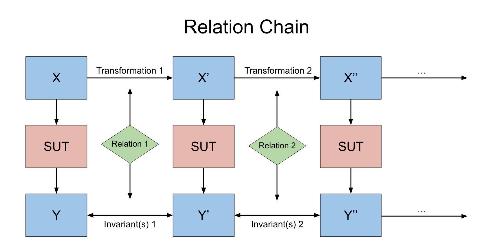

Core Concepts
=============

Understanding the fundamental concepts of metamorphic testing and how Chrysalis
implements them.

System Under Test (SUT)
------------------------

The **System Under Test** is the function or system you want to test. This can
be any callable Python object or function that takes input and produces output.

Transformations
---------------

**Transformations** are functions that modify the input data while preserving
certain properties that should be maintained by the system under test. The input
and output type of transformations **MUST** always be the same.

Characteristics of Transformations
~~~~~~~~~~~~~~~~~~~~~~~~~~~~~~~~~~~~~~~~

1. **Property Preserving**: The transformation should maintain properties that the SUT should respect
2. **Meaningful**: The transformation should represent realistic variations in input
3. **Deterministic**: Randomness should be controllable for reproducibility

Invariants
----------

**Invariants** are predicates that define relationships between the original output and the transformed
output. More simply, invariants are functions that compare two consecutive outputs of the system under
test and return a boolean value. They express properties that should hold regardless of the transformation.

Chrysalis provides several common and general invariants. Users should define their own invariants if the
subject of metamorphic testing is more specific.

Metamorphic Relations
---------------------

A **Metamorphic Relation** is the combination of a transformation and an invariant. It defines a testable
property of the system under test.

Once a transformation and invariant is defined, it is easy to register a relation.

.. code-block:: python

   chry.register(
       transformation=reverse_array,
       invariant=chry.invariants.equals
   )

Test Process
~~~~~~~~~~~~

1. Start with original input
2. Apply transformation to get transformed input
3. Run SUT on both original and transformed input
4. Check if invariant holds between outputs

Benefits of Metamorphic Testing
--------------------------------

1. **No Oracle Problem**: Don't need to know the "correct" output
2. **Property-Based**: Focus on relationships and properties
3. **Comprehensive**: Can catch subtle bugs that unit tests miss
4. **Scalable**: Easy to generate many test cases
